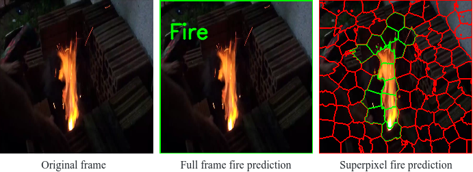

# Efficient and Compact Convolutional Neural Network Architectures for Non-temporal Real-time Fire Detection

Tested using Python >= 3.6.x, [PyTorch >= 1.5](https://pytorch.org/), and [OpenCV 3.x / 4.x](http://www.opencv.org) (requires opencv extra modules - ximgproc module for superpixel segmentation).



## Architectures:


## Abstract:

_" Automatic visual fire detection is used to complement traditional fire detection sensor systems (smoke/heat). In this work, we investigate different Convolutional Neural Network (CNN) architectures and their variants for the nontemporal real-time bounds detection of fire pixel regions in video (or still) imagery. Two reduced complexity compact CNN architectures (NasNet-A-OnFire and ShuffleNetV2-OnFire) are proposed through experimental analysis to optimise the computational efficiency for this task. The results improve upon the current state-of-the-art solution for fire detection, achieving an accuracy of 95% for full-frame binary classification and 97% for superpixel localisation. We notably achieve a classification speed up by a factor of 2.3× for binary classification and 1.3× for superpixel localisation, with runtime of 40 fps and 18 fps respectively, outperforming prior work in the field presenting an efficient, robust and real-time solution for fire region detection. Subsequent implementation on low-powered devices (Nvidia Xavier-NX, achieving 49 fps for full-frame classification via ShuffleNetV2-OnFire) demonstrates our architectures are suitable for various real-world deployment applications."_

[[Thomson, Bhowmik, Breckon, In Proc. International Conference on Machine Learning Applications, IEEE, 2020](https://breckon.org/toby/publications/papers/thompson20fire.pdf)]

[[Talk](https://www.youtube.com/embed/1haTCOHgDtQ)] [[Example](https://www.youtube.com/embed/t6r2TndNSVY)]

Our previous works on fire detection using **Alexnet** and **InceptionVx** can be found [here](https://github.com/tobybreckon/fire-detection-cnn).


---
## Installation
The code is tested on Ubuntu 18.04, and Nvidia Jetson Xavier NX using **CPU**/**GPU**/**TensorRT**.  
### Requirements for Deskop/Laptop
1. Linux (Ubuntu >= 18.04 distribution)
2. CUDA >= 10.2, cuDNN >= 7.6.0
3. Python ≥ 3.6
4. [Optional] [TensorRT](https://docs.nvidia.com/deeplearning/tensorrt/install-guide/index.html)
### Requirements for Nvidia Jetson Xavier NX
1. Linux [(Ubuntu 18.04 distribution for Xavier NX)](https://developer.nvidia.com/embedded/learn/get-started-jetson-xavier-nx-devkit#intro)
2. JetPack 4.4 (CUDA 10.2, cuDNN 8.0)
3. Python 3.6
4. [Optional] TensorRT - installs with JetPack  

### Steps
0. [Optional] create a new virtual environment.

    ~~~
    sudo apt update
    sudo apt install python3-dev python3-pip
    ~~~
    And activate the environment.

    ~~~
    source ./venv/bin/activate # sh, bash, ksh, or zsh
    ~~~
1. First clone the repository:
    ~~~
    git clone https://github.com/NeelBhowmik/efficient-compact-fire-detection-cnn.git
    ~~~

2. Install **pytorch >= 1.5.0** with torchvision (that matches the PyTorch installation - [link](https://pytorch.org/)). For pytorch installation on Xavier NX, please follow the steps from offical [link](https://forums.developer.nvidia.com/t/pytorch-for-jetson-nano-version-1-6-0-now-available/72048).

3. Install the requirements

    ~~~
    pip3 install -r requirements.txt
    ~~~
4. [Optional] Install [torch2trt](https://nvidia-ai-iot.github.io/torch2trt/master/getting_started.html) to enable TensorRT mode.
---
## Instructions to run inference using pre-trained models:
We support inference for image/image directory, video/video directory, and webcam.

1. Download pre-trained models ([**nasnetonfire/shufflenetonfire**](https://collections.durham.ac.uk/downloads/r1tb09j570z)) in ```./weights``` directory and test video in ```./demo``` directory as follows:

  ~~~
  sh ./download-models.sh
  ~~~

  This download script (```download-models.sh```) will create an additional ```weights``` directory containing the pre-trained models and ```demo``` directory containing a test video file.

2. To run {fire, no-fire} classification on **full-frame**:

    ~~~
    inference_ff.py [-h]  [--image IMAGE] [--video VIDEO]
                          [--webcam] [--camera_to_use CAMERA_TO_USE]
                          [--trt] [--model MODEL]
                          [--weight WEIGHT] [--cpu] [--output OUTPUT] [-fs]

    optional arguments:
      -h, --help            show this help message and exit
      --image IMAGE         Path to image file or image directory
      --video VIDEO         Path to video file or video directory
      --webcam              Take inputs from webcam
      --camera_to_use CAMERA_TO_USE
                            Specify camera to use for webcam option
      --trt                 Model run on TensorRT
      --model MODEL         Select the model {shufflenetonfire, nasnetonfire}
      --weight WEIGHT       Model weight file path
      --cpu                 If selected will run on CPU
      --output OUTPUT       A directory path to save output visualisations.If not
                            given , will show output in an OpenCV window.
      -fs, --fullscreen     run in full screen mode
    ~~~

    e.g. as follows ....

    ~~~
    python3 inference_ff.py \
      --video demo/test.mp4 \
      --model shufflenetonfire \
      --weight weights/shufflenet_ff.pt
    ~~~

3. To run {fire, no-fire} **superpixel localisation**:

    ~~~
    python3 inference_superpixel.py [-h] [--image IMAGE] [--video VIDEO]                               
                                         [--webcam] [--camera_to_use CAMERA_TO_USE]
                                         [--trt] [--model MODEL]
                                         [--weight WEIGHT] [--cpu]
                                         [--output OUTPUT] [-fs]

    optional arguments:
      -h, --help            show this help message and exit
      --image IMAGE         Path to image file or image directory
      --video VIDEO         Path to video file or video directory
      --webcam              Take inputs from webcam
      --camera_to_use CAMERA_TO_USE
                            Specify camera to use for webcam option
      --trt                 Model run on TensorRT
      --model MODEL         Select the model {shufflenetonfire, nasnetonfire}
      --weight WEIGHT       Model weight file path
      --cpu                 If selected will run on CPU
      --output OUTPUT       A directory to save output visualizations.If not given
                            , will show output in an OpenCV window.
      -fs, --fullscreen     run in full screen mode


    ~~~

    e.g. as follows ....

    ~~~
    python3 inference_superpixel.py \
      --video demo/test.mp4 \
      --model shufflenetonfire \
      --weight weights/shufflenet_sp.pt
    ~~~

---
## Fire Detection Datasets:

The custom dataset used for training and evaluation can be found on [Durham Collections - Thomson/Bhowmik/Breckon, 2020](https://collections.durham.ac.uk/collections/r1ww72bb497). A direct download link for the dataset is [here](https://collections.durham.ac.uk/downloads/r2d217qp536).

* DOI for datsets - [http://doi.org/10.15128/r2d217qp536](http://doi.org/10.15128/r2d217qp536).

A download script ```download-dataset.sh``` is also provided which will create an additional ```dataset``` directory containing the training dataset (10.5Gb in size, works on Linux/MacOS).

---

## References:

If you are making use of this work in any way (including our pre-trained models or datasets), _you must please_ reference the following articles in any report, publication, presentation, software release
or any other associated materials:

[Efficient and Compact Convolutional Neural Network Architectures for Non-temporal Real-time Fire Detection](https://breckon.org/toby/publications/papers/thompson20fire.pdf)
(Thomson, Bhowmik, Breckon), In Proc. International Conference on Machine Learning Applications, IEEE, 2020.
```
@InProceedings{thompson20fire,
  author = {Thompson, W. and Bhowmik, N. and Breckon, T.P.},
  title = {Efficient and Compact Convolutional Neural Network Architectures for Non-temporal Real-time Fire Detection},
  booktitle = {Proc. Int. Conf. Machine Learning Applications},
  pages = {136-141},
  year = {2020},
  month = {December},
  publisher = {IEEE},
  keywords = {fire detection, CNN, deep-learning real-time, neural architecture search, nas, automl, non-temporal},
  url = {http://breckon.org/toby/publications/papers/thompson20fire.pdf},
  doi = {10.1109/ICMLA51294.2020.00030},
  arxiv = {http://arxiv.org/abs/2010.08833},
}
```

In addition the (very permissive) terms of the [LICENSE](LICENSE) must be adhered to.

---
